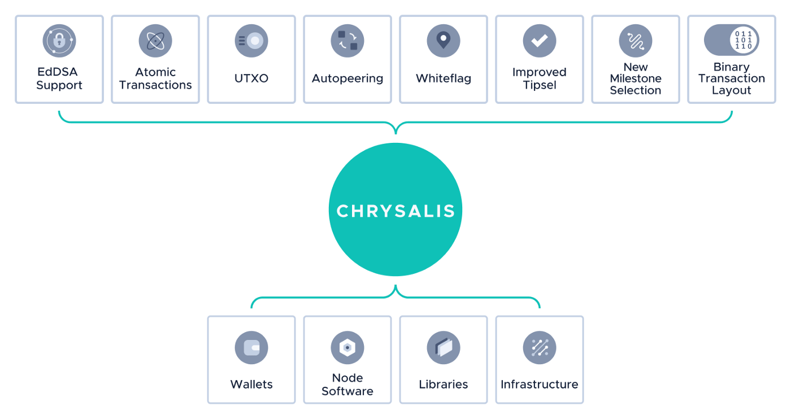

<!--
---article_info
title: Was ist neu?
author: [author_1]
reviews: [DanieKrie, skay, vrom, Marw]
---
-->

# Was ist neu?

**EdDSA Support:** Das Signaturschema Ed25519 wurde eingeführt und die alte Winternitz One-Time Signature (W-OTS) vollständig ersetzt.

**Atomic Transactions:** Das Bundle-Konstrukt wurde entfernt und durch einfachere Atomic Transaktionen ersetzt.

**UTXO Model:** Das aktuelle Guthaben-Modell zur Verfolgung von Adressen wurde auf das UTXO-Modell umgestellt.

**Autopeering:** Ein Mechanismus, der es den Nodes ermöglicht, automatisch Nachbarn auszuwählen, ohne dass der Node Operator manuell eingreifen muss.

**White-Flag:** Ein einfacherer Ansatz zur Berechnung der Guthaben, bei dem Konflikte besser vermieden werden.

**Improved-Tip-Selection (URTS):** Ein deutlich schnellerer und effizienterer Ansatz in der Node-Software, um unbestätigte Transaktionen auszuwählen.

**New Milestone Selection:** Dieser Mechanismus ermöglicht dem Netzwerk, höhere CTPS (Confirmed Transactions Per Second) durchzuführen und steigert dabei die Recheneffizienz.

**Binary Transaction Layout:** Die ehemals ternären Transaktionen wurde auf binär umgestellt.

 

 

## Die Ergebnisse des vollständigen Chrysalis Updates sind:
- Transaktionsbestätigungszeiten von etwa 10 Sekunden
- Transaktionen müssen nur noch sehr selten neu angehängt (reattached) werden
- Eine beträchtliche Erhöhung der Message Per Second (MPS) im Mainnet
- Leistungs- und Zuverlässigkeitsverbesserungen für Nodes
- Reduzierte Node-Setupzeiten durch Autopeering
- Wiederverwendbare Adressen (reusable addresses) und Unterstützung von Standard-Kryptographie (EdDSA), wodurch Hardware-Lösungen für alle wichtigen Architekturen möglich werden
- Vereinfachtes Transaktionslayout und eine Verringerung der Transaktionsgröße, wodurch die Leistung weiter gesteigert wurde
- Einführung neuer Features, wie bspw. tokenisierter Vermögenswerte (Digital Assets)
- Signifikante Verbesserungen der Nutzbarkeit und Zuverlässigkeit von IOTA

